# DOMINION AEROSPACE Index

## 🏢 Corporate Index

### 📊 Stratejik Sinerji Diyagramı

```mermaid
graph TD
    subgraph STRIKE ["Vuruş ve Derin Darbe"]
        KAAN["KAAN (5. Nesil)"]
        ANKA3["ANKA-3 (Stealth)"]
        KIZ["KIZILELMA (MİUS)"]
    end
    
    subgraph SUPPORT ["Stratejik Destek"]
        AKN["AKINCI (TİHA)"]
        FERG["FERGANİ (LEO Uydu)"]
    end
    
    FERG -.->|Veri Bağı| KAAN
    FERG -.->|Hedefleme| AKN
    KAAN ===|Hava Hakimiyeti| STRIKE
    AKN ---|Sürü Kontrol| KIZ
```

### [BAYKAR](BAYKAR/README.md)
- [AKINCI](BAYKAR/AKINCI/README.md)
- [FERGANİ](BAYKAR/FERGANİ/README.md)
- [KALKAN](BAYKAR/KALKAN/README.md)
- [KEMANKEŞ](BAYKAR/KEMANKEŞ/README.md)
- [KEMANKEŞ 2](BAYKAR/KEMANKEŞ_2/README.md)
- [KIZILELMA](BAYKAR/KIZILELMA/README.md)
- [TB2](BAYKAR/TB2/README.md)
- [TB3](BAYKAR/TB3/README.md)
- [TOMRİS](BAYKAR/TOMRİS/README.md)

### [Lentatek](Lentatek/README.md)
- [KARAYEL](Lentatek/KARAYEL/README.md)

### [ROKETSAN](ROKETSAN/README.md)
- [AKATA](ROKETSAN/AKATA/README.md)
- [ALKA](ROKETSAN/ALKA/README.md)
- [BARBAROS](ROKETSAN/BARBAROS/README.md)
- [HİSAR](ROKETSAN/HİSAR/README.md)
- [TAYFUN](ROKETSAN/TAYFUN/README.md)
- [TAYFUN BLOK4](ROKETSAN/TAYFUN_BLOK4/README.md)
- [ÇAKIR](ROKETSAN/ÇAKIR/README.md)
- [İHA-300](ROKETSAN/İHA-300/README.md)

### [TEI](TEI/README.md)
- [PD170](TEI/PD170/README.md)
- [PD222](TEI/PD222/README.md)
- [TF6000](TEI/TF6000/README.md)
- [TJ300](TEI/TJ300/README.md)
- [TJ90](TEI/TJ90/README.md)
- [TS1400](TEI/TS1400/README.md)

### [Titra](Titra/README.md)
- [ALPİN](Titra/ALPİN/README.md)
- [DELİ](Titra/DELİ/README.md)

### [TUSAŞ](TUSAŞ/README.md)
- [ANKA](TUSAŞ/ANKA/README.md)
- [ANKA-3](TUSAŞ/ANKA-3/README.md)
- [ATAK-2](TUSAŞ/ATAK-2/README.md)
- [GÖKBEY](TUSAŞ/GÖKBEY/README.md)
- [GÖKTÜRK](TUSAŞ/GÖKTÜRK/README.md)
- [HÜRJET](TUSAŞ/HÜRJET/README.md)
- [HÜRKUŞ](TUSAŞ/HÜRKUŞ/README.md)
- [KAAN](TUSAŞ/KAAN/README.md)
- [TÜRKSAT 6A](TUSAŞ/TÜRKSAT_6A/README.md)

### [TÜBİTAK SAGE](TÜBİTAK_SAGE/README.md)
- [GOKDOGAN](TÜBİTAK_SAGE/GOKDOGAN/README.md)
- [GÜNEŞ](TÜBİTAK_SAGE/GÜNEŞ/README.md)
- [KUZGUN](TÜBİTAK_SAGE/KUZGUN/README.md)
- [MORS](TÜBİTAK_SAGE/MORS/README.md)
- [SOM](TÜBİTAK_SAGE/SOM/README.md)
- [İMECE](TÜBİTAK_SAGE/İMECE/README.md)

---
[Kök Dizine Dön](../README.md)