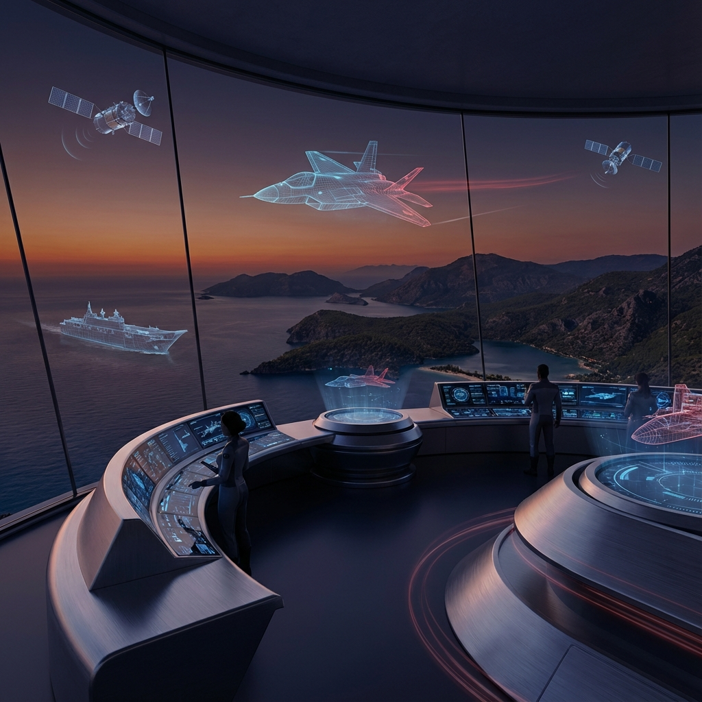

# ⚓ Proje: TCG ANADOLU (LHD - Çok Maksatlı Amfibi Hücum Gemisi)

> **"Mavi Vatan'ın Yüzen Kalesi: Dünyanın İlk SİHA Gemisi"**

TCG ANADOLU, Türk Deniz Kuvvetleri'nin en büyük amiral gemisi olup, Türkiye'nin deniz aşırı güç aktarım kabiliyetini stratejik seviyeye taşımıştır. Dünyanın ilk SİHA gemisi olma özelliğiyle deniz harp doktrinlerini yeniden yazmaktadır.

## 📝 Proje Açıklaması
TCG ANADOLU (L-400), SEDEF Tersanesi tarafından inşa edilen, çok maksatlı bir amfibi hücum gemisidir (LHD). Başlangıçta F-35B gibi dikey iniş yapabilen uçaklar için tasarlanan gemi, Türkiye'nin katmanlı otonom sistemler vizyonu doğrultusunda BAYKAR TB3 ve KIZILELMA gibi insansız hava araçlarının iniş-kalkış yapabileceği bir "SİHA Gemisi"ne dönüştürülmüştür. Bu dönüşüm, Türkiye'yi deniz havacılığında yeni bir paradigmaya öncülük eden küresel bir oyuncu haline getirmiştir.

### 🌊 Mavi Vatan'ın Hareketli Üssü
Gemi, sadece bir uçak gemisi değil, aynı zamanda havuzlu güvertesi ile amfibi çıkarma harekatlarını yönetebilen, tam teşekküllü bir hastane hizmeti sunabilen ve kriz anlarında komuta kontrol merkezi olarak görev yapabilen bir diplomatik güç unsurudur. "LHD Anadolu", Türkiye'nin okyanus ötesi operasyon yapabilme kapasitesinin en somut göstergesidir.

## 🛠 Teknik Donanım ve Kapasite

| Parametre | Değer | Kapasite / Rol |
| :--- | :--- | :--- |
| **Uzunluk / Genişlik** | 231m / 32m | Hava Ops. Alanı: 5.440 m² |
| **Deplasman** | ~27.500 ton | Maksimum Menzil: 9.000 nm |
| **Maksimum Hız** | 21 knot | Amfibi Araç Güvertesi: 1.165 m² |
| **Mürettebat** | 1.223 (Tam kapasite) | Ağır Yük Garajı: 1.410 m² |

## 🚀 Hava Gücü ve SİHA Operasyonları
TCG ANADOLU, kısa pistli gemilerden operasyon yapabilen insansız platformlar için optimize edilmiştir:
- **İnsansız Hava Gücü:** BAYKAR TB3 ve KIZILELMA entegrasyonu.
- **Döner Kanatlılar:** T129 ATAK, AH-1W Super Cobra ve SH-70B Seahawk HELO'lar.
- **HÜRJET Entegrasyonu:** Hafif taarruz ve eğitim uçağı operasyonları planlanmaktadır.

## 🛳 Operasyonel Roller
1.  **Amfibi Hücum:** Havuzlu güvertesi sayesinde ZAHA ve LCM araçlarıyla çıkarma harekatı yönetimi.
2.  **Komuta Kontrol:** ADVENT Savaş Yönetim Sistemi ile filo seviyesinde harekat yönetimi.
3.  **Lojistik ve İnsani Yardım:** Tam teşekküllü askeri hastane (32 yatak, 2 ameliyathane) ve kriz yönetim merkezi.

## 🌐 Ekosistem Entegrasyonu (Maritime Synergy)
TCG ANADOLU, Türk Deniz Kuvvetleri'nin yüzer harekat merkezidir:
- **Hava Katmanı Entegrasyonu:** BAYRAKTAR TB3 ve KIZILELMA ile "SİHA Gemisi" konseptinin dünyadaki ilk uygulayıcısı.
- **Sualtı Entegrasyonu:** STM500 ve MİLDEN denizaltılarıyla koordineli kalkan oluşturma ve çıkarma bölgesinin güvenliğini sağlama.
- **Müşterek Harekat:** ZAHA amfibi araçlarının fırlatma platformu olarak, denizden karaya güç aktarımının başlangıç noktası.
- **ADVENT SYS:** Filodaki diğer gemilerle (İ-Sınıfı, TF-2000) ortak hedef havuzu ve silah yönetimi.

## 📊 Alt Sistemler ve Yerlilik
- **ADVENT Savaş Yönetim Sistemi:** Milli yazılım altyapısıyla tüm sensör ve silahların tek merkezden yönetimi.
- **GÖKDENİZ Yakın Hava Savunma:** ASELSAN tarafından geliştirilen, güdümlü mermileri ve dronları imha eden milli CIWS sistemi.
- **Bütünleşik Haberleşme Sistemi:** Milli uydular üzerinden kesintisiz ve şifreli veri transferi sağlayan altyapı.

## 🔮 Gelecek Vizyonu ve Modernizasyon
- **KIZILELMA Operasyonel Yetkinlik:** İnsansız savaş uçaklarının gemiye otonom iniş-kalkış yapabilmesi için gerekli sistemlerin geliştirilmesi.
- **HÜRJET Deniz Varyantı:** Süpersonik jetlerin gemi pistinden operasyon yapabilmesi için kanca ve fırlatma sistemleri çalışmaları.
- **İnsansız Deniz Araçları (İDA) Anaüsü:** MARLİN ve ULAQ gibi SİDA'ların TCG Anadolu üzerinden komuta edilmesi ve ikmali.
- **LHD-2 (TCG TRAKYA):** Anadolu'nun ikizi olacak ikinci gemi ile iki farklı bölgede eş zamanlı güç aktarım kapasitesi.

## 🏗 Geliştirici Ekosistem
- **Ana Yüklenici:** SEDEF Tersanesi
- **Savaş Yönetim Sistemi:** HAVELSAN / ASELSAN (ADVENT)
- **Hava Savunma:** ASELSAN (GÖKDENİZ, STOP)

## 📁 Proje Varlıkları (Project Assets)
- (Bu proje dizininde henüz ek dosya bulunmamaktadır.)

---
[⬅️ SEDEF Ana Sayfası](../README.md) | [🏠 Ana Sayfa](../../../README.md)
