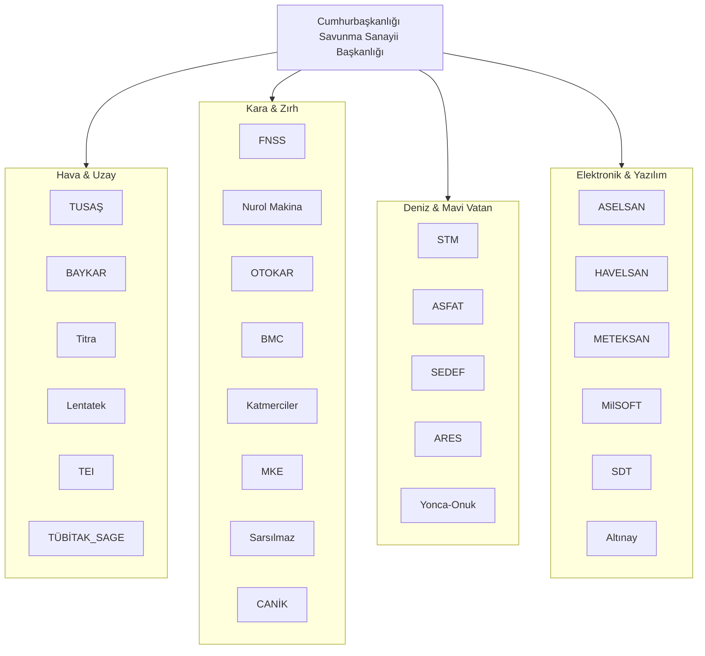

# 🇹🇷 Milli Teknoloji Envanteri (National Tech Inventory)


> **"Köklerden Göklere, Mavi Vatan'dan Uzaya!"**

Bu depo, Türkiye'nin teknoloji devlerini ve onların imza attığı **yüzlerce stratejik projeyi** bir araya getiren en kapsamlı kurumsal teknoloji kütüphanesidir. Sadece şirketleri değil, her bir projenin teknik derinliğini ve vizyonunu içeren bir "Master Catalog" niteliğindedir.

---

## 🏛️ Kurumsal Harekat Merkezleri (Corporate Nexus)

| Şirket | Sektörel Uzmanlık | Envanter Derinliği | Katalog |
| :--- | :--- | :--- | :--- |
| **🚀 TUSAŞ** | Havacılık & Uzay | KAAN, GÖKBEY, HÜRJET, ATAK-2... | [Katalog](./TUSAŞ/README.md) |
| **🦅 BAYKAR** | İHA/SİHA Teknolojileri | KIZILELMA, TB2, AKINCI, TB3... | [Katalog](./BAYKAR/README.md) |
| **📡 ASELSAN** | EH & Radar & Haberleşme | Çelik Kubbe, SİPER, GÜRZ, MURAD... | [Katalog](./ASELSAN/README.md) |
| **💥 ROKETSAN** | Füze & Uzay Sistemleri | TAYFUN, ATMACA, HİSAR, ÇAKIR... | [Katalog](./ROKETSAN/README.md) |
| **⚔️ MKE A.Ş.** | Ağır Silah & Mühimmat | FIRTINA II, Milli Deniz Topu, MPT-76... | [Katalog](./MKE/README.md) |
| **🛡️ HAVELSAN** | Yazılım & Simülasyon | ADVENT, MAIN AI, BARKAN, BAHA... | [Katalog](./HAVELSAN/README.md) |
| **🚜 Nurol Makina** | Taktik Zırhlı Araçlar | EJDER YALÇIN, YÖRÜK, ILGAZ... | [Katalog](./Nurol_Makina/README.md) |
| **🚜 FNSS** | Zırhlı Muharebe | PARS, ZAHA, KAPLAN... | [Katalog](./FNSS/README.md) |
| **🚜 BMC** | Tank & Lojistik | ALTAY, KIRPİ, VURAN... | [Katalog](./BMC/README.md) |
| **⚓ ASFAT** | Askeri Fabrikalar | PN MİLGEM, ADKG, MEMATT... | [Katalog](./ASFAT/README.md) |
| **⚓ STM** | Denizcilik & Siber | MİLGEM, STM500, KARGU, ALPAGO... | [Katalog](./STM/README.md) |
| **⚓ SEDEF** | Stratejik İnşaat | TCG ANADOLU, TCG TRAKYA... | [Katalog](./SEDEF/README.md) |
| **🚜 OTOKAR** | Zırhlı Kara Araçları | ARMA, TULPAR, ALPAR... | [Katalog](./OTOKAR/README.md) |
| **🔫 Sarsılmaz** | Hafif Silah Sistemleri | SAR9, SAR56, SARBOT... | [Katalog](./Sarsılmaz/README.md) |
| **🔫 CANİK** | Ağır Makinalı Tüfekler | CANIK M2 QCB, VENOM LR... | [Katalog](./CANİK/README.md) |
| **⚙️ TEI** | Havacılık Motorları | TS1400, TF6000, PD170, PD222... | [Katalog](./TEI/README.md) |
| **🚀 TÜBİTAK SAGE** | Füze Ar-Ge | GÖKDOĞAN, BOZDOĞAN, SOM, KUZGUN... | [Katalog](./TÜBİTAK_SAGE/README.md) |
| **📡 METEKSAN** | Savunma Elektroniği | RETINAR, YAKAMOZ, MİLDAR... | [Katalog](./METEKSAN/README.md) |
| **🚁 Titra** | İnsansız Sistemler | ALPİN, DELİ, PARS... | [Katalog](./Titra/README.md) |
| **🛡️ Altınay** | Hareket Kontrol & İHA | KOBOT, PEREGRINE... | [Katalog](./Altınay_Savunma/README.md) |

---

## 🔍 Hızlı Arama
Depo içerisindeki tüm projeleri listelemek için:
```powershell
python inventory_manager.py --list
```

## 📈 Sektörel Ekosistem Haritası



---
**"Gelecek Burada, Tam Bağımsız Türkiye!"** 🇹🇷
