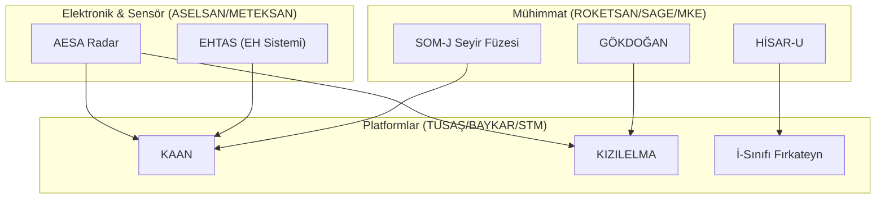

# 🇹🇷 Milli Teknoloji Envanteri (National Tech Inventory)

> **"Köklerden Göklere, Mavi Vatan'dan Uzaya: Tam Bağımsız Türkiye!"**

## 🛡️ Stratejik Egemenlik Manifestosu (Strategic Sovereignty)
Bu envanter, sadece bir proje listesi değil; Türkiye'nin **2053 ve 2071 vizyonlarına** giden yolda döşenen teknolojik taşların dökümüdür. "Tam Bağımsızlık" ilkesiyle, ithal ikameci anlayıştan teknoloji ihraç eden ve doktrin belirleyen bir güç haline gelen Türk mühendisliğinin kolektif hafızasıdır.

---

## 🏗️ Teknolojik Katmanlar (Technological Layers)
Türkiye'nin teknoloji ekosistemi üç ana katmanda derinleşmektedir:

*   **Katman 0: Donanım ve Malzeme**: İleri kompozitler, radar emici boyalar, GaN tabanlı yarı iletkenler.
*   **Katman 1: Yazılım ve Akıl**: Görev bilgisayarları, tamamen milli işletim sistemleri ve otonom sürü sürücü algoritmaları.
*   **Katman 2: Enerji ve Tahrik**: Türbofan motorlar (TF6000), katı yakıtlı roket motorları ve elektrikli tahrik sistemleri.

---

## 🏛️ Kurumsal Dominion Yapısı ve Sektörel Derin Dalış

### 🌌 DOMINION AEROSPACE (Hava & Uzay)
| Proje / Platform | Üretici | Stratejik Önem | TRL (Tahmini) |
| :--- | :--- | :--- | :--- |
| **[KAAN](./DOMINION_AEROSPACE/TUSAŞ/KAAN/README.md)** | TUSAŞ | 5. Nesil Görünmezlik | TRL 6-7 |
| **[KIZILELMA](./DOMINION_AEROSPACE/BAYKAR/KIZILELMA/README.md)** | BAYKAR | İnsansız Hava Muharebesi | TRL 8 |
| **[ANKA-3](./DOMINION_AEROSPACE/TUSAŞ/ANKA-3/README.md)** | TUSAŞ | Derin Darbe (Stealth) | TRL 7 |
| **[HÜRJET](./DOMINION_AEROSPACE/TUSAŞ/HÜRJET/README.md)** | TUSAŞ | Jet Eğitim & Taarruz | TRL 8 |
| **[AKINCI](./DOMINION_AEROSPACE/BAYKAR/AKINCI/README.md)** | BAYKAR | Stratejik TİHA | TRL 9 |
| **[TAYFUN](./DOMINION_AEROSPACE/ROKETSAN/TAYFUN/README.md)** | ROKETSAN | Balistik Caydırıcılık | TRL 8 |

### 🚜 DOMINION LAND (Kara & Zırh)
| Proje / Platform | Üretici | Stratejik Önem | TRL (Tahmini) |
| :--- | :--- | :--- | :--- |
| **[ALTAY](./DOMINION_LAND/BMC/ALTAY/README.md)** | BMC | Ana Muharebe Tankı | TRL 9 |
| **[ARMA II](./DOMINION_LAND/OTOKAR/ARMA/README.md)** | OTOKAR | Modüler Zırhlı Araç | TRL 9 |
| **[ZAHA](./DOMINION_LAND/FNSS/ZAHA/README.md)** | FNSS | Amfibi Hücum | TRL 9 |
| **[EJDER YALÇIN](./DOMINION_LAND/Nurol_Makina/README.md)** | Nurol Makina | Yüksek Koruma | TRL 9 |
| **[SARBOT](./DOMINION_LAND/Sarsılmaz/README.md)** | Sarsılmaz | Silahlı Robotik | TRL 7 |

### ⚓ DOMINION SEA (Mavi Vatan)
| Proje / Platform | Üretici | Stratejik Önem | TRL (Tahmini) |
| :--- | :--- | :--- | :--- |
| **[TCG ANADOLU](./DOMINION_SEA/SEDEF/TCG_ANADOLU/README.md)** | SEDEF | SİHA Gemisi / LHD | TRL 9 |
| **[STM500](./DOMINION_SEA/STM/STM500/README.md)** | STM | Küçük Sınıf Denizaltı | TRL 6 |
| **[ULAQ](./DOMINION_SEA/ARES/README.md)** | ARES | Silahlı SİDA | TRL 9 |
| **[PN MİLGEM](./DOMINION_SEA/ASFAT/README.md)** | ASFAT | Fırkateyn İhracatı | TRL 9 |

### 📡 DOMINION ELECTRONICS (Dijital Egemenlik)
| Proje / Platform | Üretici | Stratejik Önem | TRL (Tahmini) |
| :--- | :--- | :--- | :--- |
| **[SİPER](./DOMINION_ELECTRONICS/ASELSAN/SİPER/README.md)** | ASELSAN | Uzun Menzilli HSS | TRL 8 |
| **[BARKAN](./DOMINION_ELECTRONICS/HAVELSAN/BARKAN/README.md)** | HAVELSAN | Otonom İKA | TRL 9 |
| **[GÜRZ](./DOMINION_ELECTRONICS/ASELSAN/GÜRZ/README.md)** | ASELSAN | Hibrit Hava Savunma | TRL 8 |
| **[MAIN AI](./DOMINION_ELECTRONICS/HAVELSAN/MAIN_AI/README.md)** | HAVELSAN | Askeri Yapay Zeka | TRL 7 |

---

## 🔗 Ekosistem Entegrasyonu (Ecosystem Integration)

Aşağıdaki diyagram, farklı Dominion'lar arasındaki derin bağımlılığı ve işbirliğini göstermektedir:

---

## 📈 Gelişim Yol Haritası (Roadmap)
- [x] Kurumsal Dominon Yapılandırması
- [x] Sinematik Hero Banner Entegrasyonu
- [x] Sektörel Derin Dalış Tabloları
- [x] Teknolojik Katmanlar Arşivi
- [/] Her Proje İçin Detaylı Teknik "Spec-Sheet" Hazırlanması

---
**"Yarın Değil, Şimdi! Gelecek Burada."** 🇹🇷
