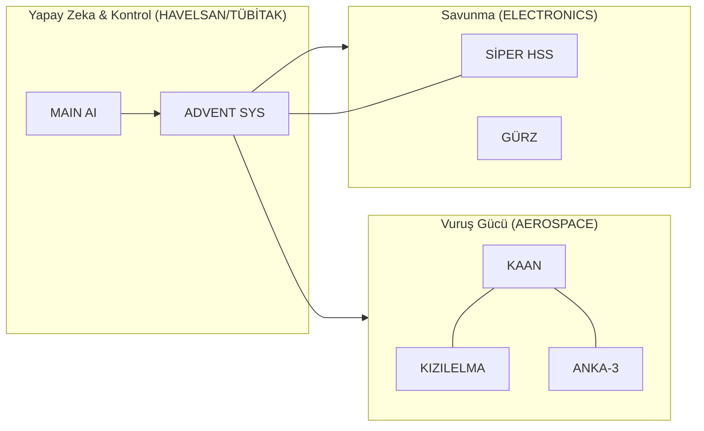

# 🇹🇷 Milli Teknoloji Envanteri (National Tech Inventory)

> **"Köklerden Göklere, Mavi Vatan'dan Uzaya: Tam Bağımsız Türkiye!"**

## 🛡️ Stratejik Egemenlik Manifestosu (Strategic Sovereignty)
Bu envanter, sadece bir proje listesi değil; Türkiye'nin **2053 ve 2071 vizyonlarına** giden yolda döşenen teknolojik taşların dökümüdür. "Tam Bağımsızlık" ilkesiyle, ithal ikameci anlayıştan teknoloji ihraç eden ve doktrin belirleyen bir güç haline gelen Türk mühendisliğinin kolektif hafızasıdır.

### 🎯 Temel Hedefler:
1.  **Dışa Bağımlılığın Sıfırlanması:** Kritik alt sistemlerin (Motor, Radar, Yazılım) %100 yerlileştirilmesi.
2.  **Önleyici Savunma Doktrini:** Tehdidi kendi sınırları dışında, otonom ve akıllı sistemlerle durdurma kapasitesi.
3.  **Küresel Teknoloji İhracatı:** Standart belirleyen, oyun değiştirici platformları (SİHA, İDA, İKA) dünya pazarına sunma.

---

## 🏗️ Teknolojik Katmanlar ve Derinlik (Technological Layers)
Türkiye'nin teknoloji ekosistemi üç ana katmanda derinleşmektedir:

### 💎 Katman 0: Donanım ve Malzeme (The Foundation)
- **İleri Kompozitler:** KAAN ve KIZILELMA için radar emici özel gövde malzemeleri.
- **GaN Teknolojisi:** ASELSAN bünyesinde üretilen, AESA radarlarının çekirdeğini oluşturan Galyum Nitrat yarı iletkenler.
- **Zırh Çelikleri:** ALTAY ve ZAHA için geliştirilen milli yüksek mukavemetli çelik alaşımlar.

### 🧠 Katman 1: Yazılım ve Akıl (The Intelligence)
- **ADVENT SYS:** Dünyanın en gelişmiş ağ merkezli harekat yönetim yazılımlarından biri.
- **Milli İşletim Sistemleri:** Kritik görev bilgisayarlarında çalışan gerçek zamanlı (RTOS) sistemler.
- **MAIN AI:** Askeri doktrine hakim, kapalı devre çalışan milli büyük dil modeli.

### ⚙️ Katman 2: Enerji ve Tahrik (The Power)
- **TF6000/TF10000:** Türkiye'nin ilk milli turbofan motor projeleri.
- **BATU & UTKU:** Tank ve hafif zırhlı araçlar için geliştirilen milli güç grupları.
- **Katı Yakıtlı Roketler:** Balistik füzeler ve uzay araçları için geliştirilen yüksek itkili yakıt teknolojileri.

---

## 🏛️ Kurumsal Dominion Yapısı ve Stratejik Derinlik

### 🌌 [DOMINION AEROSPACE (Hava & Uzay)](./DOMINION_AEROSPACE/README.md)
| Proje / Platform | Üretici | Stratejik Önem | TRL |
| :--- | :--- | :--- | :--- |
| **[KAAN](./DOMINION_AEROSPACE/TUSAŞ/KAAN/README.md)** | TUSAŞ | 5. Nesil Görünmezlik | TRL 7 |
| **[ANKA-3](./DOMINION_AEROSPACE/TUSAŞ/ANKA-3/README.md)** | TUSAŞ | Derin Darbe (Stealth) | TRL 7 |
| **[KIZILELMA](./DOMINION_AEROSPACE/BAYKAR/KIZILELMA/README.md)** | BAYKAR | İnsansız Hava Muharebesi | TRL 8 |
| **[HÜRJET](./DOMINION_AEROSPACE/TUSAŞ/HÜRJET/README.md)** | TUSAŞ | Jet Eğitim & Taarruz | TRL 8 |
| **[AKINCI](./DOMINION_AEROSPACE/BAYKAR/AKINCI/README.md)** | BAYKAR | Stratejik TİHA | TRL 9 |
| **[TAYFUN](./DOMINION_AEROSPACE/ROKETSAN/TAYFUN/README.md)** | ROKETSAN | Balistik Caydırıcılık | TRL 8 |

### 🚜 [DOMINION LAND (Kara & Zırh)](./DOMINION_LAND/README.md)
| Proje / Platform | Üretici | Stratejik Önem | TRL |
| :--- | :--- | :--- | :--- |
| **[ALTAY](./DOMINION_LAND/BMC/ALTAY/README.md)** | BMC | Ana Muharebe Tankı | TRL 9 |
| **[ARMA II](./DOMINION_LAND/OTOKAR/ARMA/README.md)** | OTOKAR | Modüler Zırhlı Araç | TRL 9 |
| **[ZAHA](./DOMINION_LAND/FNSS/ZAHA/README.md)** | FNSS | Amfibi Hücum | TRL 9 |
| **[BARKAN](./DOMINION_ELECTRONICS/HAVELSAN/BARKAN/README.md)** | HAVELSAN | otonom İKA Sınıfı | TRL 9 |

### ⚓ [DOMINION SEA (Mavi Vatan)](./DOMINION_SEA/README.md)
| Proje / Platform | Üretici | Stratejik Önem | TRL |
| :--- | :--- | :--- | :--- |
| **[TCG ANADOLU](./DOMINION_SEA/SEDEF/TCG_ANADOLU/README.md)** | SEDEF | SİHA Gemisi / LHD | TRL 9 |
| **[STM500](./DOMINION_SEA/STM/STM500/README.md)** | STM | Küçük Sınıf Denizaltı | TRL 6 |

### 📡 [DOMINION ELECTRONICS & AI (Dijital Egemenlik)](./DOMINION_ELECTRONICS/README.md)
| Proje / Platform | Üretici | Stratejik Önem | TRL |
| :--- | :--- | :--- | :--- |
| **[SİPER](./DOMINION_ELECTRONICS/ASELSAN/SİPER/README.md)** | ASELSAN | Uzun Menzilli HSS | TRL 8 |
| **[GÜRZ](./DOMINION_ELECTRONICS/ASELSAN/GÜRZ/README.md)** | ASELSAN | Hibrit Hava Savunma | TRL 8 |
| **[MAIN AI](./DOMINION_ELECTRONICS/HAVELSAN/MAIN_AI/README.md)** | HAVELSAN | Askeri Yapay Zeka | TRL 7 |

---

## 🔗 Ekosistem Entegrasyonu (Electronic & Neural Synergy)

Aşağıdaki diyagram, platformların birbirine nasıl "sinirsel" olarak bağlı olduğunu gösterir:

---

## 📈 Gelişim Yol Haritası (Roadmap)
- [x] Kurumsal Dominon Yapılandırması
- [x] Sinematik Hero Banner Entegrasyonu
- [x] Sektörel Derin Dalış Tabloları
- [x] Teknolojik Katmanlar Arşivi
- [x] 15+ Kritik Proje İçin Detaylı "Spec-Sheet" Hazırlanması
- [/] Envanter Takip Yazılımı (inventory_manager.py) Geliştirmesi
- [x] Sektörel ve Kurumsal Hiyerarşik İndeksleme
- [ ] Karma Sürü Simülasyon Modülleri Entegrasyonu

---

## 📁 Depo Varlıkları (Repository Assets)
- [.gitignore](.gitignore)
- [CONTRIBUTING.md](CONTRIBUTING.md)
- [LICENSE](LICENSE)
- [inventory_manager.py](inventory_manager.py)

---

**"Yarın Değil, Şimdi! Gelecek Burada."** 🇹🇷
