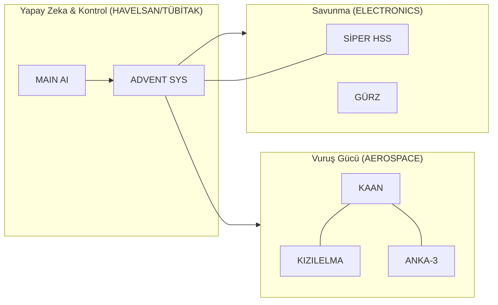

# 🇹🇷 Milli Teknoloji Envanteri (National Tech Inventory)

> **"Köklerden Göklere, Mavi Vatan'dan Uzaya: Tam Bağımsız Türkiye!"**
>
> 
> 
> 
> 

## 🛡️ Stratejik Egemenlik Manifestosu (Strategic Sovereignty)
Bu envanter, sadece bir proje listesi değil; Türkiye'nin **2053 ve 2071 vizyonlarına** giden yolda döşenen teknolojik taşların dökümüdür. "Tam Bağımsızlık" ilkesiyle, ithal ikameci anlayıştan teknoloji ihraç eden ve doktrin belirleyen bir güç haline gelen Türk mühendisliğinin kolektif hafızasıdır.

### 🎯 Temel Hedefler:
1.  **Dışa Bağımlılığın Sıfırlanması:** Kritik alt sistemlerin (Motor, Radar, Yazılım) %100 yerlileştirilmesi.
2.  **Önleyici Savunma Doktrini:** Tehdidi kendi sınırları dışında, otonom ve akıllı sistemlerle durdurma kapasitesi.
3.  **Küresel Teknoloji İhracatı:** Standart belirleyen, oyun değiştirici platformları (SİHA, İDA, İKA) dünya pazarına sunma.

---

## 🏗️ Teknolojik Katmanlar ve Derinlik (Technological Layers)
Türkiye'nin teknoloji ekosistemi üç ana katmanda derinleşmektedir:

### 💎 Katman 0: Donanım ve Malzeme (The Foundation)
- **İleri Kompozitler:** KAAN ve KIZILELMA için radar emici özel gövde malzemeleri.
- **GaN Teknolojisi:** ASELSAN bünyesinde üretilen, AESA radarlarının çekirdeğini oluşturan Galyum Nitrat yarı iletkenler.
- **Zırh Çelikleri:** ALTAY ve ZAHA için geliştirilen milli yüksek mukavemetli çelik alaşımlar.

### 🧠 Katman 1: Yazılım ve Akıl (The Intelligence)
- **ADVENT SYS:** Dünyanın en gelişmiş ağ merkezli harekat yönetim yazılımlarından biri.
- **Milli İşletim Sistemleri:** Kritik görev bilgisayarlarında çalışan gerçek zamanlı (RTOS) sistemler.
- **MAIN AI:** Askeri doktrine hakim, kapalı devre çalışan milli büyük dil modeli.

### ⚙️ Katman 2: Enerji ve Tahrik (The Power)
- **TF6000/TF10000:** Türkiye'nin ilk milli turbofan motor projeleri.
- **BATU & UTKU:** Tank ve hafif zırhlı araçlar için geliştirilen milli güç grupları.
- **Katı Yakıtlı Roketler:** Balistik füzeler ve uzay araçları için geliştirilen yüksek itkili yakıt teknolojileri.

---

## 🏛️ Kurumsal Dominion Yapısı ve Stratejik Derinlik

> [!NOTE]
> Bu bölümdeki veriler, `inventory_manager.py` analiz motoru tarafından doğrulanmış teknik değerleri (TRL, Stratejik Seviye) yansıtmaktadır.

### 🌌 [DOMINION AEROSPACE (Hava & Uzay)](./DOMINION_AEROSPACE/README.md)
| Proje / Platform | Üretici | Stratejik Önem | TRL |
| :--- | :--- | :--- | :--- |
| **[AKINCI](./DOMINION_AEROSPACE/BAYKAR/AKINCI/README.md)** | BAYKAR | Stratejik TİHA | TRL 9 |
| **[FERGANİ](./DOMINION_AEROSPACE/BAYKAR/FERGANİ/README.md)** | BAYKAR | LEO Takım Uydu / Küresel Konumlama | TRL 9 |
| **[KALKAN](./DOMINION_AEROSPACE/BAYKAR/KALKAN/README.md)** | BAYKAR | Detaylı analiz bekleniyor | TRL 1-3 |
| **[KEMANKEŞ](./DOMINION_AEROSPACE/BAYKAR/KEMANKEŞ/README.md)** | BAYKAR | Mini Akıllı Seyir Füzesi | TRL 7 |
| **[KEMANKEŞ 2](./DOMINION_AEROSPACE/BAYKAR/KEMANKEŞ_2/README.md)** | BAYKAR | Detaylı analiz bekleniyor | TRL 1-3 |
| **[KIZILELMA](./DOMINION_AEROSPACE/BAYKAR/KIZILELMA/README.md)** | BAYKAR | İnsansız Hava Muharebesi | TRL 8 |
| **[TB2](./DOMINION_AEROSPACE/BAYKAR/TB2/README.md)** | BAYKAR | Taktik SİHA (Combat Proven) | TRL 9 |
| **[TB3](./DOMINION_AEROSPACE/BAYKAR/TB3/README.md)** | BAYKAR | Kısa Pist / Gemi Konuşlu SİHA | TRL 7 |
| **[TOMRİS](./DOMINION_AEROSPACE/BAYKAR/TOMRİS/README.md)** | BAYKAR | Detaylı analiz bekleniyor | TRL 1-3 |

| **[KARAYEL](./DOMINION_AEROSPACE/Lentatek/KARAYEL/README.md)** | Lentatek | Detaylı analiz bekleniyor | TRL 1-3 |
| **[AKATA](./DOMINION_AEROSPACE/ROKETSAN/AKATA/README.md)** | ROKETSAN | Detaylı analiz bekleniyor | TRL 1-3 |
| **[AKYA](./DOMINION_SEA/ROKETSAN/AKYA/README.md)** | ROKETSAN | Yeni Nesil Ağır Sınıf Torpido (50+ km) | TRL 9 |
| **[HİSAR](./DOMINION_AEROSPACE/ROKETSAN/HİSAR/README.md)** | ROKETSAN | Milli Hava Savunma Ailesi (A+/O+/RF) | TRL 9 |
| **[KARAOK](./DOMINION_LAND/ROKETSAN/KARAOK/README.md)** | ROKETSAN | Omuzdan Atılan Tanksavar (2.5 km) | TRL 9 |
| **[LEVENT](./DOMINION_AEROSPACE/ROKETSAN/LEVENT/README.md)** | ROKETSAN | Detaylı analiz bekleniyor | TRL 1-3 |
| **[ORKA](./DOMINION_AEROSPACE/ROKETSAN/ORKA/README.md)** | ROKETSAN | Detaylı analiz bekleniyor | TRL 1-3 |
| **[SUNGUR](./DOMINION_LAND/ROKETSAN/SUNGUR/README.md)** | ROKETSAN | Portatif Hava Savunma Füze Sistemi (8 km) | TRL 9 |
| **[TAYFUN](./DOMINION_AEROSPACE/ROKETSAN/TAYFUN/README.md)** | ROKETSAN | Balistik Caydırıcılık (560+ km) | TRL 9 |
| **[TAYFUN BLOK4](./DOMINION_AEROSPACE/ROKETSAN/TAYFUN_BLOK4/README.md)** | ROKETSAN | Detaylı analiz bekleniyor | TRL 1-3 |
| **[ÇAKIR](./DOMINION_AEROSPACE/ROKETSAN/ÇAKIR/README.md)** | ROKETSAN | Yeni Nesil Seyir Füzesi (150+ km) | TRL 9 |

| **[İHA-300](./DOMINION_AEROSPACE/ROKETSAN/İHA-300/README.md)** | ROKETSAN | Detaylı analiz bekleniyor | TRL 1-3 |
| **[PD170](./DOMINION_AEROSPACE/TEI/PD170/README.md)** | TEI | Turbodizel İHA Motoru (170 HP) | TRL 9 |
| **[PD222](./DOMINION_AEROSPACE/TEI/PD222/README.md)** | TEI | Turbodizel İHA Motoru (220 HP) | TRL 8 |
| **[TF6000](./DOMINION_AEROSPACE/TEI/TF6000/README.md)** | TEI | Askeri Turbofan Motor (6000 lbf) | TRL 7 |
| **[TJ300](./DOMINION_AEROSPACE/TEI/TJ300/README.md)** | TEI | Orta Menzil Füze Motoru | TRL 9 |
| **[TJ90](./DOMINION_AEROSPACE/TEI/TJ90/README.md)** | TEI | Mini Füze Motoru | TRL 9 |
| **[TS1400](./DOMINION_AEROSPACE/TEI/TS1400/README.md)** | TEI | Milli Helikopter Motoru (Turboşaft) | TRL 8 |
| **[ANKA-3](./DOMINION_AEROSPACE/TUSAŞ/ANKA-3/README.md)** | TUSAŞ | Derin Darbe (Stealth) İnsansız Savaş Uçağı | TRL 7 |
| **[ATAK-2](./DOMINION_AEROSPACE/TUSAŞ/ATAK-2/README.md)** | TUSAŞ | Ağır Sınıf Taarruz Helikopteri | TRL 7 |
| **[GÖKBEY](./DOMINION_AEROSPACE/TUSAŞ/GÖKBEY/README.md)** | TUSAŞ | Genel Maksat Helikopteri | TRL 8 |
| **[GÖKTÜRK](./DOMINION_AEROSPACE/TUSAŞ/GÖKTÜRK/README.md)** | TUSAŞ | Keşif Gözetleme Uydusu | TRL 9 |
| **[HÜRJET](./DOMINION_AEROSPACE/TUSAŞ/HÜRJET/README.md)** | TUSAŞ | Jet Eğitim & Taarruz Uçağı | TRL 8 |
| **[HÜRKUŞ](./DOMINION_AEROSPACE/TUSAŞ/HÜRKUŞ/README.md)** | TUSAŞ | Temel Eğitim ve Hafif Taarruz Uçağı | TRL 9 |
| **[KAAN](./DOMINION_AEROSPACE/TUSAŞ/KAAN/README.md)** | TUSAŞ | 5. Nesil Milli Muharip Uçak | TRL 7 |
| **[TÜRKSAT 6A](./DOMINION_AEROSPACE/TUSAŞ/TÜRKSAT_6A/README.md)** | TUSAŞ | İlk Milli Haberleşme Uydusu | TRL 8 |
| **[ALPİN](./DOMINION_AEROSPACE/Titra/ALPİN/README.md)** | Titra | İnsansız Helikopter | TRL 7 |
| **[DELİ](./DOMINION_AEROSPACE/Titra/DELİ/README.md)** | Titra | Kamikaze İHA | TRL 9 |
| **[GOKDOGAN](./DOMINION_AEROSPACE/TÜBİTAK_SAGE/GOKDOGAN/README.md)** | TÜBİTAK SAGE | Görüş Ötesi Hava-Hava Füzesi (BVRAAM) | TRL 9 |
| **[GÜNEŞ](./DOMINION_AEROSPACE/TÜBİTAK_SAGE/GÜNEŞ/README.md)** | TÜBİTAK SAGE | Güdüm Kiti | TRL 9 |
| **[KUZGUN](./DOMINION_AEROSPACE/TÜBİTAK_SAGE/KUZGUN/README.md)** | TÜBİTAK SAGE | Modüler Mühimmat Ailesi | TRL 7 |
| **[MORS](./DOMINION_AEROSPACE/TÜBİTAK_SAGE/MORS/README.md)** | TÜBİTAK SAGE | Havan Mühimmatı | TRL 9 |
| **[SOM](./DOMINION_AEROSPACE/TÜBİTAK_SAGE/SOM/README.md)** | TÜBİTAK SAGE | Seyir Füzesi (Cruise Missile) | TRL 9 |
| **[İMECE](./DOMINION_AEROSPACE/TÜBİTAK_SAGE/İMECE/README.md)** | TÜBİTAK SAGE | Metre Altı Çözünürlüklü Gözlem Uydusu | TRL 9 |

### 📡 [DOMINION ELECTRONICS & AI (Dijital Egemenlik)](./DOMINION_ELECTRONICS/README.md)
| Proje / Platform | Üretici | Stratejik Önem | TRL |
| :--- | :--- | :--- | :--- |
| **[ALBATROS-S](./DOMINION_ELECTRONICS/ASELSAN/ALBATROS-S/README.md)** | ASELSAN | Detaylı analiz bekleniyor | TRL 1-3 |
| **[ASELFLIR-500](./DOMINION_ELECTRONICS/ASELSAN/ASELFLIR-500/README.md)** | ASELSAN | Detaylı analiz bekleniyor | TRL 1-3 |
| **[CENK 350N](./DOMINION_ELECTRONICS/ASELSAN/CENK_350N/README.md)** | ASELSAN | 4 Yüzlü AESA Gemi Radarı | TRL 7 |
| **[EJDERHA](./DOMINION_ELECTRONICS/ASELSAN/EJDERHA/README.md)** | ASELSAN | Yüksek Güçlü Elektromanyetik Silah | TRL 7 |
| **[ERALP](./DOMINION_ELECTRONICS/ASELSAN/ERALP/README.md)** | ASELSAN | Detaylı analiz bekleniyor | TRL 1-3 |
| **[GÖKTAN](./DOMINION_ELECTRONICS/ASELSAN/GÖKTAN/README.md)** | ASELSAN | AESA İHA Radarı (SAR/GMTI) | TRL 7 |
| **[GÜRZ](./DOMINION_ELECTRONICS/ASELSAN/GÜRZ/README.md)** | ASELSAN | Hibrit Hava Savunma Sistemi | TRL 8 |
| **[IHTAR](./DOMINION_ELECTRONICS/ASELSAN/IHTAR/README.md)** | ASELSAN | Anti-Drone Sistemi (Soft/Hard Kill) | TRL 9 |
| **[KORAL](./DOMINION_ELECTRONICS/ASELSAN/KORAL/README.md)** | ASELSAN | Mobil/Stratejik Elektronik Harp Sistemi | TRL 9 |
| **[MURAD](./DOMINION_ELECTRONICS/ASELSAN/MURAD/README.md)** | ASELSAN | AESA Burun Radarı (GaN Teknolojisi) | TRL 8 |
| **[MİLKAR](./DOMINION_ELECTRONICS/ASELSAN/MİLKAR/README.md)** | ASELSAN | Detaylı analiz bekleniyor | TRL 1-3 |
| **[SANCAK](./DOMINION_ELECTRONICS/ASELSAN/SANCAK/README.md)** | ASELSAN | Detaylı analiz bekleniyor | TRL 1-3 |
| **[SİPER](./DOMINION_ELECTRONICS/ASELSAN/SİPER/README.md)** | ASELSAN | Uzun Menzilli HSS (150+ km) | TRL 8 |
| **[TOYGUN](./DOMINION_ELECTRONICS/ASELSAN/TOYGUN/README.md)** | ASELSAN | Elektro-Optik Hedefleme Sistemi (EOTS) | TRL 6 |

| **[TURAN](./DOMINION_ELECTRONICS/ASELSAN/TURAN/README.md)** | ASELSAN | Detaylı analiz bekleniyor | TRL 1-3 |
| **[ULAQ](./DOMINION_ELECTRONICS/ASELSAN/ULAQ/README.md)** | ASELSAN | Detaylı analiz bekleniyor | TRL 1-3 |
| **[GIMBAL SISTEMLERI](./DOMINION_ELECTRONICS/Altınay_Savunma/GIMBAL_SISTEMLERI/README.md)** | Altınay Savunma | İHA Kamera Sistemleri | TRL 9 |
| **[KOBOT](./DOMINION_ELECTRONICS/Altınay_Savunma/KOBOT/README.md)** | Altınay Savunma | Bomba İmha Robotu | TRL 9 |
| **[PEREGRINE](./DOMINION_ELECTRONICS/Altınay_Savunma/PEREGRINE/README.md)** | Altınay Savunma | Güdümlü Mühimmat | TRL 7 |
| **[ADVENT](./DOMINION_ELECTRONICS/HAVELSAN/ADVENT/README.md)** | HAVELSAN | Ağ Destekli Savaş Yönetim Sistemi | TRL 9 |
| **[BAHA](./DOMINION_ELECTRONICS/HAVELSAN/BAHA/README.md)** | HAVELSAN | Bulut Altı İHA | TRL 9 |
| **[BARKAN](./DOMINION_ELECTRONICS/HAVELSAN/BARKAN/README.md)** | HAVELSAN | Orta Sınıf İnsansız Kara Aracı | TRL 9 |
| **[CYBER SECURITY](./DOMINION_ELECTRONICS/HAVELSAN/CYBER_SECURITY/README.md)** | HAVELSAN | Siber Güvenlik Operasyon Merkezi | TRL 9 |
| **[KAPGAN](./DOMINION_ELECTRONICS/HAVELSAN/KAPGAN/README.md)** | HAVELSAN | Ağır Sınıf İnsansız Kara Aracı | TRL 7 |
| **[MAIN AI](./DOMINION_ELECTRONICS/HAVELSAN/MAIN_AI/README.md)** | HAVELSAN | Kurumsal/Askeri Üretken Yapay Zeka | TRL 7 |
| **[SANCAR](./DOMINION_ELECTRONICS/HAVELSAN/SANCAR/README.md)** | HAVELSAN | SİDA (Sancar Sınıfı) | TRL 8 |
| **[SIMULATORS](./DOMINION_ELECTRONICS/HAVELSAN/SIMULATORS/README.md)** | HAVELSAN | Askeri ve Sivil Simülatörler | TRL 9 |
| **[MİLDAR](./DOMINION_ELECTRONICS/METEKSAN/MİLDAR/README.md)** | METEKSAN | Milimetre Dalga Radarı (Helikopter/İHA) | TRL 8 |
| **[RETINAR](./DOMINION_ELECTRONICS/METEKSAN/RETINAR/README.md)** | METEKSAN | Çevre Gözetleme Radarı | TRL 9 |
| **[YAKAMOZ](./DOMINION_ELECTRONICS/METEKSAN/YAKAMOZ/README.md)** | METEKSAN | Karinaya Monteli Sonar Sistemi | TRL 9 |
| **[DATA LINKS](./DOMINION_ELECTRONICS/MilSOFT/DATA_LINKS/README.md)** | MilSOFT | Taktik Veri Linkleri (Link-16/22/JREAP) | TRL 9 |
| **[ACMI POD](./DOMINION_ELECTRONICS/SDT/ACMI_POD/README.md)** | SDT | Hava Muharebe Eğitim Sistemi | TRL 9 |

### 🚜 [DOMINION LAND (Kara & Zırh)](./DOMINION_LAND/README.md)
| Proje / Platform | Üretici | Stratejik Önem | TRL |
| :--- | :--- | :--- | :--- |
| **[ALTAY](./DOMINION_LAND/BMC/ALTAY/README.md)** | BMC | Yeni Nesil Ana Muharebe Tankı | TRL 9 |
| **[KIRPI](./DOMINION_LAND/BMC/KIRPI/README.md)** | BMC | Mayına Karşı Korumalı Araç (MRAP) | TRL 9 |
| **[KİRPİ II](./DOMINION_LAND/BMC/KİRPİ_II/README.md)** | BMC | Gelişmiş MRAP (Bağımsız Süspansiyon) | TRL 9 |
| **[VURAN](./DOMINION_LAND/BMC/VURAN/README.md)** | BMC | Taktik Tekerlekli Zırhlı Araç (4x4) | TRL 9 |
| **[M2 QCB](./DOMINION_LAND/CANİK/M2_QCB/README.md)** | CANİK | Detaylı analiz bekleniyor | TRL 1-3 |
| **[METE MC9](./DOMINION_LAND/CANİK/METE_MC9/README.md)** | CANİK | Detaylı analiz bekleniyor | TRL 1-3 |
| **[VENOM LR](./DOMINION_LAND/CANİK/VENOM_LR/README.md)** | CANİK | Detaylı analiz bekleniyor | TRL 1-3 |
| **[KAPLAN](./DOMINION_LAND/FNSS/KAPLAN/README.md)** | FNSS | Orta Sınıf Tank / Silah Taşıyıcı Araç | TRL 9 |
| **[PARS](./DOMINION_LAND/FNSS/PARS/README.md)** | FNSS | Taktik Tekerlekli Zırhlı Araç (6x6/8x8) | TRL 9 |
| **[PARS 4x4](./DOMINION_LAND/FNSS/PARS_4x4/README.md)** | FNSS | Özel Maksatlı Taktik Araç | TRL 9 |
| **[SAMUR](./DOMINION_LAND/FNSS/SAMUR/README.md)** | FNSS | Seyyar Yüzücü Hücum Köprüsü | TRL 9 |
| **[ZAHA](./DOMINION_LAND/FNSS/ZAHA/README.md)** | FNSS | Zırhlı Amfibi Hücum Aracı | TRL 9 |
| **[HIZIR](./DOMINION_LAND/Katmerciler/HIZIR/README.md)** | Katmerciler | Detaylı analiz bekleniyor | TRL 1-3 |
| **[KIRAÇ](./DOMINION_LAND/Katmerciler/KIRAÇ/README.md)** | Katmerciler | Detaylı analiz bekleniyor | TRL 1-3 |
| **[76MM DENİZ TOPU](./DOMINION_LAND/MKE/76MM_DENİZ_TOPU/README.md)** | MKE | Milli Gemi Topu | TRL 9 |
| **[FIRTINA II](./DOMINION_LAND/MKE/FIRTINA_II/README.md)** | MKE | Kundağı Motorlu Obüs (155mm) | TRL 9 |
| **[MPT-76](./DOMINION_LAND/MKE/MPT-76/README.md)** | MKE | Milli Piyade Tüfeği | TRL 9 |
| **[PIRANA](./DOMINION_LAND/MKE/PIRANA/README.md)** | MKE | Detaylı analiz bekleniyor | TRL 1-3 |
| **[TOLGA](./DOMINION_LAND/MKE/TOLGA/README.md)** | MKE | Detaylı analiz bekleniyor | TRL 1-3 |
| **[YAVUZ](./DOMINION_LAND/MKE/YAVUZ/README.md)** | MKE | Kamyona Monteli Obüs (155mm) | TRL 9 |
| **[EJDER YALÇIN](./DOMINION_LAND/Nurol_Makina/EJDER_YALÇIN/README.md)** | Nurol Makina | Detaylı analiz bekleniyor | TRL 1-3 |
| **[ILGAZ](./DOMINION_LAND/Nurol_Makina/ILGAZ/README.md)** | Nurol Makina | Detaylı analiz bekleniyor | TRL 1-3 |
| **[YÖRÜK](./DOMINION_LAND/Nurol_Makina/YÖRÜK/README.md)** | Nurol Makina | Detaylı analiz bekleniyor | TRL 1-3 |
| **[AKREP II](./DOMINION_LAND/OTOKAR/AKREP_II/README.md)** | OTOKAR | Elektrikli Zırhlı Keşif Aracı | TRL 8 |
| **[ALPAR](./DOMINION_LAND/OTOKAR/ALPAR/README.md)** | OTOKAR | Ağır Sınıf İnsansız Kara Aracı | TRL 6 |
| **[ARMA](./DOMINION_LAND/OTOKAR/ARMA/README.md)** | OTOKAR | 6x6 Modüler Zırhlı Araç | TRL 9 |
| **[COBRA II](./DOMINION_LAND/OTOKAR/COBRA_II/README.md)** | OTOKAR | Taktik Tekerlekli Zırhlı Araç | TRL 9 |
| **[TULPAR](./DOMINION_LAND/OTOKAR/TULPAR/README.md)** | OTOKAR | Yeni Nesil ZMA (Ağır Sınıf) | TRL 8 |

| **[SAR127](./DOMINION_LAND/Sarsılmaz/SAR127/README.md)** | Sarsılmaz | Detaylı analiz bekleniyor | TRL 1-3 |
| **[SAR56](./DOMINION_LAND/Sarsılmaz/SAR56/README.md)** | Sarsılmaz | Detaylı analiz bekleniyor | TRL 1-3 |
| **[SAR9](./DOMINION_LAND/Sarsılmaz/SAR9/README.md)** | Sarsılmaz | Detaylı analiz bekleniyor | TRL 1-3 |
| **[SARBOT](./DOMINION_LAND/Sarsılmaz/SARBOT/README.md)** | Sarsılmaz | Detaylı analiz bekleniyor | TRL 1-3 |

### ⚓ [DOMINION SEA (Mavi Vatan)](./DOMINION_SEA/README.md)
| Proje / Platform | Üretici | Stratejik Önem | TRL |
| :--- | :--- | :--- | :--- |
| **[ARES 150](./DOMINION_SEA/ARES/ARES_150/README.md)** | ARES | Süratli Devriye Botu | TRL 9 |
| **[ULAQ DERE](./DOMINION_SEA/ARES/ULAQ_DERE/README.md)** | ARES | Silahlı İnsansız Deniz Aracı (SİDA) | TRL 9 |
| **[ADKG](./DOMINION_SEA/ASFAT/ADKG/README.md)** | ASFAT | Açık Deniz Karakol Gemisi (HİSAR Sınıfı) | TRL 7 |
| **[HİSAR SINIFI OPV](./DOMINION_SEA/ASFAT/HİSAR_SINIFI_OPV/README.md)** | ASFAT | Açık Deniz Karakol Gemisi (HİSAR Sınıfı) | TRL 7 |
| **[MEMATT](./DOMINION_SEA/ASFAT/MEMATT/README.md)** | ASFAT | Mekanik Mayın Temizleme Teçhizatı | TRL 9 |
| **[PN MILGEM](./DOMINION_SEA/ASFAT/PN_MILGEM/README.md)** | ASFAT | Ağır Korvet / Hafif Firkateyn (Babur Sınıfı) | TRL 9 |
| **[TCG ANADOLU](./DOMINION_SEA/SEDEF/TCG_ANADOLU/README.md)** | SEDEF | Çok Maksatlı Amfibi Hücum Gemisi (LHD) | TRL 9 |
| **[TCG TRAKYA](./DOMINION_SEA/SEDEF/TCG_TRAKYA/README.md)** | SEDEF | Uçak Gemisi (Planlama Aşamasında) | TRL 1 |
| **[KARGU](./DOMINION_SEA/STM/KARGU/README.md)** | STM | Kamikaze İHA (Döner Kanatlı) | TRL 9 |
| **[MİLGEM](./DOMINION_SEA/STM/MİLGEM/README.md)** | STM | ADA Sınıfı Korvet | TRL 9 |
| **[STM500](./DOMINION_SEA/STM/STM500/README.md)** | STM | Küçük Sınıf Denizaltı | TRL 6 |

| **[MRTP24](./DOMINION_SEA/Yonca-Onuk/MRTP24/README.md)** | Yonca-Onuk | Detaylı analiz bekleniyor | TRL 1-3 |
| **[MRTP SERISI](./DOMINION_SEA/Yonca-Onuk/MRTP_SERISI/README.md)** | Yonca-Onuk | Detaylı analiz bekleniyor | TRL 1-3 |

---

## 🔗 Ekosistem Entegrasyonu (Electronic & Neural Synergy)

Aşağıdaki diyagram, platformların birbirine nasıl "sinirsel" olarak bağlı olduğunu gösterir:

---

## 📈 Gelişim Yol Haritası (Roadmap)
- [x] Kurumsal Dominon Yapılandırması
- [x] Sinematik Hero Banner Entegrasyonu
- [x] Sektörel Derin Dalış Tabloları
- [x] Teknolojik Katmanlar Arşivi
- [x] 15+ Kritik Proje İçin Detaylı "Spec-Sheet" Hazırlanması
- [/] Envanter Takip Yazılımı (inventory_manager.py) Geliştirmesi
- [x] Sektörel ve Kurumsal Hiyerarşik İndeksleme
- [ ] Karma Sürü Simülasyon Modülleri Entegrasyonu

---

## 📁 Depo Varlıkları (Repository Assets)
- [.gitignore](.gitignore)
- [CONTRIBUTING.md](CONTRIBUTING.md)
- [LICENSE](LICENSE)
- [inventory_manager.py](inventory_manager.py)

---

**"Yarın Değil, Şimdi! Gelecek Burada."** 🇹🇷
